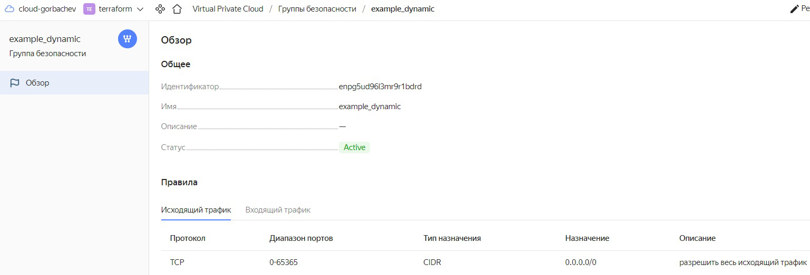
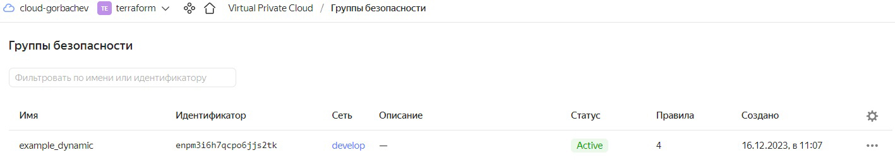
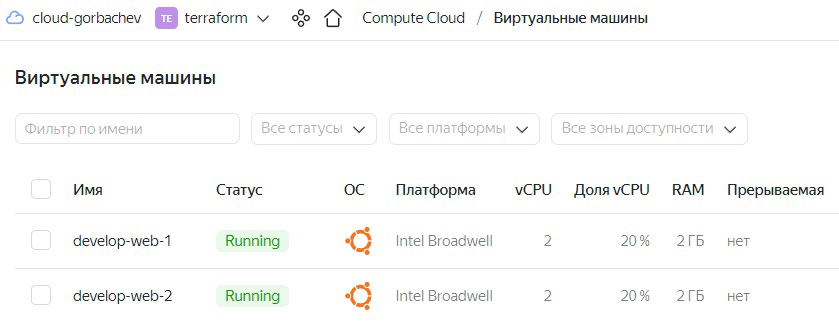
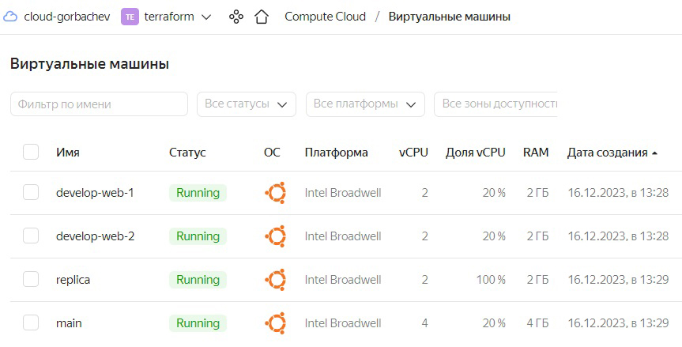
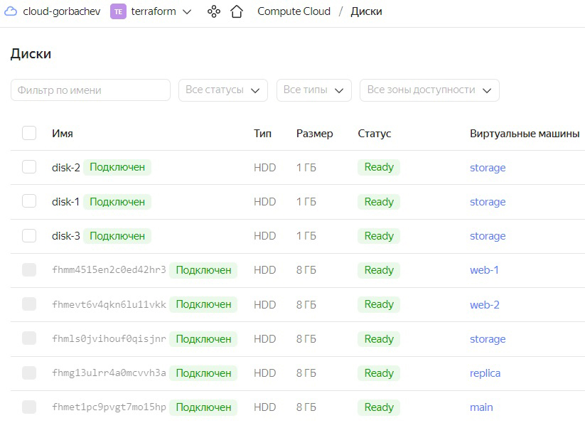
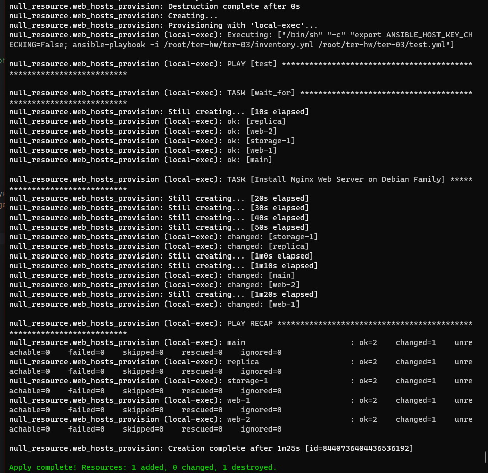
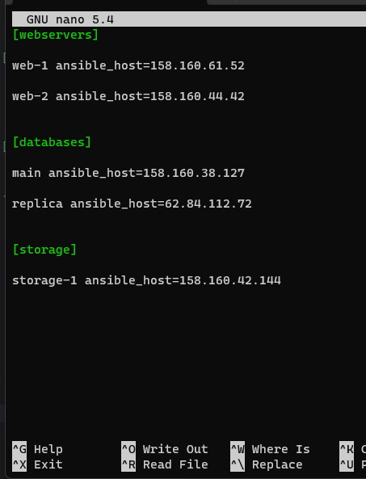

# Домашнее задание к занятию "Управляющие конструкции в коде Terraform" - `Горбачев Олег`

### Задание 1

1. Изучите проект.
2. Заполните файл personal.auto.tfvars
3. Инициализируйте проект, выполните код (он выполнится даже если доступа к preview нет).

Примечание: Если у вас не активирован preview доступ к функционалу "Группы безопасности" в Yandex Cloud - запросите доступ у поддержки облачного провайдера. Обычно его выдают в течении 24-х часов.

Приложите скриншот входящих правил "Группы безопасности" в ЛК Yandex Cloud  или скриншот отказа в предоставлении доступа к preview версии.


------

### Задание 2

1. Создайте файл count-vm.tf. Опишите в нем создание двух **одинаковых** ВМ  web-1 и web-2(не web-0 и web-1!), с минимальными параметрами, используя мета-аргумент **count loop**. Назначьте ВМ созданную в 1-м задании группу безопасности.

Создадим файл [count-vm.tf](src%2Fcount-vm.tf):
```
data "yandex_compute_image" "ubuntu" {
  family = "ubuntu-2004-lts"
}

resource "yandex_compute_instance" "count" {
  count = 2
  name        = "web-${count.index+1}"
  platform_id = "standard-v1"
  resources {
    cores         = 2
    memory        = 1
    core_fraction = 5
  }
  boot_disk {
    initialize_params {
      image_id = data.yandex_compute_image.ubuntu.image_id
    }
  }
  scheduling_policy {
    preemptible = true
  }
  network_interface {
    subnet_id = yandex_vpc_subnet.develop.id
    nat       = true
    security_group_ids = [yandex_vpc_security_group.example.id]
  }

  metadata = {
    serial-port-enable = 1
    ssh-keys           = "ubuntu:ssh-ed25519 AAAAC3NzaC1lZDI1NTE5AAAAII2kpc8hkCtD5uVQdw0wUeGlNp/rKarSrCKoifhuRtCF shakal@Razer"
  }

}
```




Создадим файл [for_each-vm.tf](src%2Ffor_each-vm.tf) и добавим переменную ```each_vm``` в [variables.tf](src%2Fvariables.tf):
```
resource "yandex_compute_instance" "for_each" {
  depends_on = [yandex_compute_instance.count]
  for_each = {
    main = var.each_vm[0]
    replica = var.each_vm[1]
  }
  name        = "${each.key}"
  platform_id = "standard-v1"
  resources {
    cores         = "${each.value.cpu}"
    memory        = "${each.value.ram}"
    core_fraction = 5
  }
  boot_disk {
    initialize_params {
      image_id = data.yandex_compute_image.ubuntu.image_id
      type = "network-hdd"
      size = "${each.value.disk}"
    }
  }
  scheduling_policy {
    preemptible = true
  }
  network_interface {
    subnet_id = yandex_vpc_subnet.develop.id
    nat       = true
    security_group_ids = [yandex_vpc_security_group.example.id]
  }

  metadata = {
    serial-port-enable = 1
    ssh-keys           = local.ssh
  }

}
```
```
variable "each_vm" {
  type = list(object({  cpu=number, ram=number, disk=number }))
  default = [
    {  cpu=4, ram=2, disk=10 },
    {  cpu=2, ram=1, disk=15 }
  ]
}
```

Добавим в [for_each-vm.tf](src%2Ffor_each-vm.tf) атрибут ```depends_on = [yandex_compute_instance.count]```, чтобы данный ресурс создавался после первых ВМ

Создадим файл [locals.tf](src%2Flocals.tf), куда внесем переменную ```ssh```, для считывания ключа ~/.ssh/id_ed25519.pub и его последующего использования в блоке metadata:
```
locals {
  ssh = "${"ubuntu"}:${file("~/.ssh/id_ed25519.pub")}"
}
```

*Созданные в указанном порядке ВМ:*



Инициализируйте проект, выполните код.

<details>
 <summary>РЕЗУЛЬТАТ</summary>
   
```bash
gorbachev@debian:~/ter-homeworks/03/src$ terraform apply

Terraform used the selected providers to generate the following execution plan. Resource actions are indicated with the following symbols:
  + create

Terraform will perform the following actions:

  # yandex_compute_instance.fe_instance["main"] will be created
  + resource "yandex_compute_instance" "fe_instance" {
      + created_at                = (known after apply)
      + folder_id                 = (known after apply)
      + fqdn                      = (known after apply)
      + gpu_cluster_id            = (known after apply)
      + hostname                  = (known after apply)
      + id                        = (known after apply)
      + metadata                  = {
          + "ssh-keys" = <<-EOT
                ubuntu:ssh-rsa AAAAB3.......................................................................RAqNVz gorbachev@debian
            EOT
        }
      + name                      = "main"
      + network_acceleration_type = "standard"
      + platform_id               = "standard-v1"
      + service_account_id        = (known after apply)
      + status                    = (known after apply)
      + zone                      = (known after apply)

      + boot_disk {
          + auto_delete = true
          + device_name = (known after apply)
          + disk_id     = (known after apply)
          + mode        = (known after apply)

          + initialize_params {
              + block_size  = (known after apply)
              + description = (known after apply)
              + image_id    = "fd8g64rcu9fq5kpfqls0"
              + name        = (known after apply)
              + size        = (known after apply)
              + snapshot_id = (known after apply)
              + type        = "network-hdd"
            }
        }

      + network_interface {
          + index              = (known after apply)
          + ip_address         = (known after apply)
          + ipv4               = true
          + ipv6               = (known after apply)
          + ipv6_address       = (known after apply)
          + mac_address        = (known after apply)
          + nat                = true
          + nat_ip_address     = (known after apply)
          + nat_ip_version     = (known after apply)
          + security_group_ids = (known after apply)
          + subnet_id          = (known after apply)
        }

      + resources {
          + core_fraction = 20
          + cores         = 4
          + memory        = 4
        }
    }

  # yandex_compute_instance.fe_instance["replica"] will be created
  + resource "yandex_compute_instance" "fe_instance" {
      + created_at                = (known after apply)
      + folder_id                 = (known after apply)
      + fqdn                      = (known after apply)
      + gpu_cluster_id            = (known after apply)
      + hostname                  = (known after apply)
      + id                        = (known after apply)
      + metadata                  = {
          + "ssh-keys" = <<-EOT
                ubuntu:ssh-rsa AAAAB3.......................................................................RAqNVz gorbachev@debian
            EOT
        }
      + name                      = "replica"
      + network_acceleration_type = "standard"
      + platform_id               = "standard-v1"
      + service_account_id        = (known after apply)
      + status                    = (known after apply)
      + zone                      = (known after apply)

      + boot_disk {
          + auto_delete = true
          + device_name = (known after apply)
          + disk_id     = (known after apply)
          + mode        = (known after apply)

          + initialize_params {
              + block_size  = (known after apply)
              + description = (known after apply)
              + image_id    = "fd8g64rcu9fq5kpfqls0"
              + name        = (known after apply)
              + size        = (known after apply)
              + snapshot_id = (known after apply)
              + type        = "network-hdd"
            }
        }

      + network_interface {
          + index              = (known after apply)
          + ip_address         = (known after apply)
          + ipv4               = true
          + ipv6               = (known after apply)
          + ipv6_address       = (known after apply)
          + mac_address        = (known after apply)
          + nat                = true
          + nat_ip_address     = (known after apply)
          + nat_ip_version     = (known after apply)
          + security_group_ids = (known after apply)
          + subnet_id          = (known after apply)
        }

      + resources {
          + core_fraction = 100
          + cores         = 2
          + memory        = 2
        }
    }

  # yandex_compute_instance.web[0] will be created
  + resource "yandex_compute_instance" "web" {
      + created_at                = (known after apply)
      + folder_id                 = (known after apply)
      + fqdn                      = (known after apply)
      + gpu_cluster_id            = (known after apply)
      + hostname                  = (known after apply)
      + id                        = (known after apply)
      + metadata                  = {
          + "ssh-keys" = <<-EOT
                ubuntu:ssh-rsa AAAAB3.......................................................................RAqNVz gorbachev@debian
            EOT
        }
      + name                      = "web-1"
      + network_acceleration_type = "standard"
      + platform_id               = "standard-v1"
      + service_account_id        = (known after apply)
      + status                    = (known after apply)
      + zone                      = (known after apply)

      + boot_disk {
          + auto_delete = true
          + device_name = (known after apply)
          + disk_id     = (known after apply)
          + mode        = (known after apply)

          + initialize_params {
              + block_size  = (known after apply)
              + description = (known after apply)
              + image_id    = "fd8g64rcu9fq5kpfqls0"
              + name        = (known after apply)
              + size        = (known after apply)
              + snapshot_id = (known after apply)
              + type        = "network-hdd"
            }
        }

      + network_interface {
          + index              = (known after apply)
          + ip_address         = (known after apply)
          + ipv4               = true
          + ipv6               = (known after apply)
          + ipv6_address       = (known after apply)
          + mac_address        = (known after apply)
          + nat                = true
          + nat_ip_address     = (known after apply)
          + nat_ip_version     = (known after apply)
          + security_group_ids = (known after apply)
          + subnet_id          = (known after apply)
        }

      + resources {
          + core_fraction = 20
          + cores         = 2
          + memory        = 2
        }
    }

  # yandex_compute_instance.web[1] will be created
  + resource "yandex_compute_instance" "web" {
      + created_at                = (known after apply)
      + folder_id                 = (known after apply)
      + fqdn                      = (known after apply)
      + gpu_cluster_id            = (known after apply)
      + hostname                  = (known after apply)
      + id                        = (known after apply)
      + metadata                  = {
          + "ssh-keys" = <<-EOT
                ubuntu:ssh-rsa AAAAB3.......................................................................RAqNVz gorbachev@debian
            EOT
        }
      + name                      = "web-2"
      + network_acceleration_type = "standard"
      + platform_id               = "standard-v1"
      + service_account_id        = (known after apply)
      + status                    = (known after apply)
      + zone                      = (known after apply)

      + boot_disk {
          + auto_delete = true
          + device_name = (known after apply)
          + disk_id     = (known after apply)
          + mode        = (known after apply)

          + initialize_params {
              + block_size  = (known after apply)
              + description = (known after apply)
              + image_id    = "fd8g64rcu9fq5kpfqls0"
              + name        = (known after apply)
              + size        = (known after apply)
              + snapshot_id = (known after apply)
              + type        = "network-hdd"
            }
        }

      + network_interface {
          + index              = (known after apply)
          + ip_address         = (known after apply)
          + ipv4               = true
          + ipv6               = (known after apply)
          + ipv6_address       = (known after apply)
          + mac_address        = (known after apply)
          + nat                = true
          + nat_ip_address     = (known after apply)
          + nat_ip_version     = (known after apply)
          + security_group_ids = (known after apply)
          + subnet_id          = (known after apply)
        }

      + resources {
          + core_fraction = 20
          + cores         = 2
          + memory        = 2
        }
    }

  # yandex_vpc_network.develop will be created
  + resource "yandex_vpc_network" "develop" {
      + created_at                = (known after apply)
      + default_security_group_id = (known after apply)
      + folder_id                 = (known after apply)
      + id                        = (known after apply)
      + labels                    = (known after apply)
      + name                      = "develop"
      + subnet_ids                = (known after apply)
    }

  # yandex_vpc_security_group.example will be created
  + resource "yandex_vpc_security_group" "example" {
      + created_at = (known after apply)
      + folder_id  = "b1gads94fhccurj7j4uk"
      + id         = (known after apply)
      + labels     = (known after apply)
      + name       = "example_dynamic"
      + network_id = (known after apply)
      + status     = (known after apply)

      + egress {
          + description    = "разрешить весь исходящий трафик"
          + from_port      = 0
          + id             = (known after apply)
          + labels         = (known after apply)
          + port           = -1
          + protocol       = "TCP"
          + to_port        = 65365
          + v4_cidr_blocks = [
              + "0.0.0.0/0",
            ]
          + v6_cidr_blocks = []
        }

      + ingress {
          + description    = "разрешить входящий  http"
          + from_port      = -1
          + id             = (known after apply)
          + labels         = (known after apply)
          + port           = 80
          + protocol       = "TCP"
          + to_port        = -1
          + v4_cidr_blocks = [
              + "0.0.0.0/0",
            ]
          + v6_cidr_blocks = []
        }
      + ingress {
          + description    = "разрешить входящий https"
          + from_port      = -1
          + id             = (known after apply)
          + labels         = (known after apply)
          + port           = 443
          + protocol       = "TCP"
          + to_port        = -1
          + v4_cidr_blocks = [
              + "0.0.0.0/0",
            ]
          + v6_cidr_blocks = []
        }
      + ingress {
          + description    = "разрешить входящий ssh"
          + from_port      = -1
          + id             = (known after apply)
          + labels         = (known after apply)
          + port           = 22
          + protocol       = "TCP"
          + to_port        = -1
          + v4_cidr_blocks = [
              + "0.0.0.0/0",
            ]
          + v6_cidr_blocks = []
        }
    }

  # yandex_vpc_subnet.develop will be created
  + resource "yandex_vpc_subnet" "develop" {
      + created_at     = (known after apply)
      + folder_id      = (known after apply)
      + id             = (known after apply)
      + labels         = (known after apply)
      + name           = "develop"
      + network_id     = (known after apply)
      + v4_cidr_blocks = [
          + "10.0.1.0/24",
        ]
      + v6_cidr_blocks = (known after apply)
      + zone           = "ru-central1-a"
    }

Plan: 7 to add, 0 to change, 0 to destroy.

Do you want to perform these actions?
  Terraform will perform the actions described above.
  Only 'yes' will be accepted to approve.

  Enter a value: yes

yandex_vpc_network.develop: Creating...
yandex_vpc_network.develop: Creation complete after 2s [id=enpkf1dv1gq2qg5d3ipb]
yandex_vpc_subnet.develop: Creating...
yandex_vpc_security_group.example: Creating...
yandex_vpc_subnet.develop: Creation complete after 0s [id=e9b9spar0vshlgfbpudl]
yandex_compute_instance.web[1]: Creating...
yandex_compute_instance.web[0]: Creating...
yandex_vpc_security_group.example: Creation complete after 1s [id=enp58tt9q52khoo9i1q4]
yandex_compute_instance.web[1]: Still creating... [10s elapsed]
yandex_compute_instance.web[0]: Still creating... [10s elapsed]
yandex_compute_instance.web[1]: Still creating... [20s elapsed]
yandex_compute_instance.web[0]: Still creating... [20s elapsed]
yandex_compute_instance.web[1]: Still creating... [30s elapsed]
yandex_compute_instance.web[0]: Still creating... [30s elapsed]
yandex_compute_instance.web[0]: Creation complete after 39s [id=fhmdm9d51cm90o7679i5]
yandex_compute_instance.web[1]: Still creating... [40s elapsed]
yandex_compute_instance.web[1]: Creation complete after 45s [id=fhmigjpjm8c8nofat616]
yandex_compute_instance.fe_instance["replica"]: Creating...
yandex_compute_instance.fe_instance["main"]: Creating...
yandex_compute_instance.fe_instance["replica"]: Still creating... [10s elapsed]
yandex_compute_instance.fe_instance["main"]: Still creating... [10s elapsed]
yandex_compute_instance.fe_instance["replica"]: Still creating... [20s elapsed]
yandex_compute_instance.fe_instance["main"]: Still creating... [20s elapsed]
yandex_compute_instance.fe_instance["replica"]: Still creating... [30s elapsed]
yandex_compute_instance.fe_instance["main"]: Still creating... [30s elapsed]
yandex_compute_instance.fe_instance["main"]: Creation complete after 35s [id=fhmpgu7n8bhoc589e8k1]
yandex_compute_instance.fe_instance["replica"]: Creation complete after 39s [id=fhmmcp64om0rck1kdj5n]

Apply complete! Resources: 7 added, 0 changed, 0 destroyed.
```
</details>

------

### Задание 3

1. Создайте 3 одинаковых виртуальных диска, размером 1 Гб с помощью ресурса yandex_compute_disk и мета-аргумента count в файле **disk_vm.tf** .
2. Создайте в том же файле одну ВМ c именем "storage" . Используйте блок **dynamic secondary_disk{..}** и мета-аргумент for_each для подключения созданных вами дополнительных дисков.
Создадим файл [disk_vm.tf](src%2Fdisk_vm.tf) и внесем в него ресурс ```yandex_compute_disk```:
```
resource "yandex_compute_disk" "disk_vm" {
  count = 3
  name = "${"disk"}-${count.index}"
  size = 1
}
```
Добавим в файл [disk_vm.tf](src%2Fdisk_vm.tf) инструкции по созданию дополнительной ВМ и подключению к ней созданных дисков, добавим дополнительно инструкцию ```depends_on = [yandex_compute_disk.disk_vm]```, чтобы ВМ создавалась только после создания дисков:

```
resource "yandex_compute_instance" "storage" {
  name        = "storage"
  depends_on = [yandex_compute_disk.disk_vm]
  platform_id = "standard-v1"
  resources {
    cores         = 2
    memory        = 1
    core_fraction = 5
  }
  boot_disk {
    initialize_params {
      image_id = data.yandex_compute_image.ubuntu.image_id
    }
  }

dynamic "secondary_disk" {
  for_each = yandex_compute_disk.disk_vm[*].id
  content {
    disk_id = secondary_disk.value
  }
}

  scheduling_policy {
    preemptible = true
  }
  network_interface {
    subnet_id = yandex_vpc_subnet.develop.id
    nat       = true
    security_group_ids = [yandex_vpc_security_group.example.id]
  }

  metadata = {
    serial-port-enable = 1
    ssh-keys           = "ubuntu:ssh-ed25519 AAAAC3NzaC1lZDI1NTE5AAAAII2kpc8hkCtD5uVQdw0wUeGlNp/rKarSrCKoifhuRtCF shakal@Razer"
  }

}
```
Инициализируем проект:
```
Plan: 4 to add, 0 to change, 0 to destroy.

Do you want to perform these actions?
  Terraform will perform the actions described above.
  Only 'yes' will be accepted to approve.

  Enter a value: yes

yandex_compute_disk.disk_vm[0]: Creating...
yandex_compute_disk.disk_vm[2]: Creating...
yandex_compute_disk.disk_vm[1]: Creating...
yandex_compute_disk.disk_vm[0]: Creation complete after 7s [id=fhmjo6adscnlu308rfdo]
yandex_compute_disk.disk_vm[2]: Creation complete after 7s [id=fhmhe8hpktb181rsuaip]
yandex_compute_disk.disk_vm[1]: Still creating... [10s elapsed]
yandex_compute_disk.disk_vm[1]: Still creating... [20s elapsed]
yandex_compute_disk.disk_vm[1]: Still creating... [30s elapsed]
yandex_compute_disk.disk_vm[1]: Still creating... [40s elapsed]
yandex_compute_disk.disk_vm[1]: Creation complete after 40s [id=fhm19phfeaemg4ovo78b]
yandex_compute_instance.storage: Creating...
yandex_compute_instance.storage: Still creating... [10s elapsed]
yandex_compute_instance.storage: Still creating... [20s elapsed]
yandex_compute_instance.storage: Still creating... [30s elapsed]
yandex_compute_instance.storage: Creation complete after 34s [id=fhm78165hu031u274849]

Apply complete! Resources: 4 added, 0 changed, 0 destroyed.
```



------

### Задание 4

1. В файле ansible.tf создайте inventory-файл для ansible. Используйте функцию tepmplatefile и файл-шаблон для создания ansible inventory-файла из лекции. Готовый код возьмите из демонстрации к лекции demonstration2. Передайте в него в качестве переменных группы виртуальных машин из задания 2.1, 2.2 и 3.2, т. е. 5 ВМ.
2. Инвентарь должен содержать 3 группы [webservers], [databases], [storage] и быть динамическим, т. е. обработать как группу из 2-х ВМ, так и 999 ВМ.
3. Выполните код. Приложите скриншот получившегося файла.

Создадим файл [ansible.tf](src%2Fansible.tf):
```
resource "local_file" "ansible_inventory" {
  filename = "./inventory.yml"
  content = templatefile("ansible.tftpl", {
    webservers = yandex_compute_instance.count,
    databases = yandex_compute_instance.for_each,
    storage = yandex_compute_instance.storage,
  })
}
```
Создадим файл-шаблон [ansible.tftpl](src%2Fansible.tftpl):
```
[webservers]
%{ for i in webservers }
${i["name"]} ansible_host=${i["network_interface"][0]["nat_ip_address"]}
%{ endfor }

[databases]
%{ for i in databases }
${i["name"]} ansible_host=${i["network_interface"][0]["nat_ip_address"]}
%{ endfor }

[storage]
%{ for i in storage }
${i["name"]} ansible_host=${i["network_interface"][0]["nat_ip_address"]}
%{ endfor }
```
Для того чтобы работала подстановка адресов группы ```storage```, в файле [disk_vm.tf](src%2Fdisk_vm.tf) необходимо добавить цикличность создания ВМ:
```
resource "yandex_compute_instance" "storage" {
  count = 1
  name        = "storage-${count.index+1}"
  depends_on = [yandex_compute_disk.disk_vm]
  platform_id = "standard-v1"
```
Выполним код:



Получившийся [inventory.yml](src%2Finventory.yml):


  
------

